

# 📊 ELITE ADMIN DASHBOARD - ADVANCED UI/UX ARCHITECTURE

### 🏆 Precision-Engineered for Extreme Scalability, Fluidity, and Semantic Flawlessness

 

---

[**🌐 Explore Live Demo**](https://ahmed-let-front.github.io/Dashboard-01/)

---

### 🛠️ CORE TECH STACK

|                                                                                                           |                                                                                                        |                                                                                                                              |                                                                                                                          |
| :-------------------------------------------------------------------------------------------------------: | :----------------------------------------------------------------------------------------------------: | :--------------------------------------------------------------------------------------------------------------------------: | :----------------------------------------------------------------------------------------------------------------------: |
|  |  |  |  |
|     |     |                         |                       |

## 🚀 ADVANCED FRONT-END ENGINEERING PHILOSOPHY

This application goes far beyond standard UI templates. I built it with a deep, methodical understanding of browser rendering engines, CSS Cascade Layers, Semantic DOM Architecture, and build-tool optimization.

- **Zero-JS State Management:** Built highly interactive toggle switches pushing state mutations entirely to the CSS engine via the `:has()` pseudo-class and the `peer` sibling combinator.
- **Fluid Typography:** Utilized the CSS `clamp()` function for fluid, real-time typographic scaling without media-query bloat.
- **GPU Acceleration:** Strictly prohibited layout-thrashing properties (`margin`/`padding`) for interactive hover states, relying exclusively on `transform` and `will-change` to maintain a rock-solid **60 FPS**.

---

## 🧩 ENGINEERING CHALLENGES & SOLUTIONS

During the development of this architecture, I encountered several complex UI/UX and deployment edge cases. Here is how I engineered the solutions from the ground up:

### 🎒 Challenge 1: Strict DOM Semantics & The "Bag" Mental Model

- **The Concept:** Understanding the strict W3C rules for lists (`<ul>`, `<ol>`, `<li>`) and navigation (`<nav>`) to ensure 100% Screen Reader accessibility.
- **The Engineering Solution:** I developed the **"Container Bag" Mental Model**. I conceptualized the `<ul>` as a strict "outer bag" that only accepts one type of item: the `<li>` (the "inner bag"). The `<li>` acts as the versatile carrier that holds the actual payload (like `<a>`, `<label>`, or `
`). This deep understanding prevented invalid DOM nesting. Furthermore, I treated the `<nav>` tag with the semantic gravity of an `<h1>`, reserving it exclusively for the main routing sidebar and actively preventing "landmark spam" in utility areas.

### 🐛 Challenge 2: GitHub Pages Build Minification (The Unicode Bug)

- **The Bug:** During production deployment via Vite to GitHub Pages, the Unicode characters used for checkboxes (e.g., `\f00c` for FontAwesome checkmarks) were mangled by the minifier/encoding process, rendering as broken "M" symbols or empty squares.
- **The Engineering Solution (Handcrafted CSS):** I bypassed external font dependencies and Unicode entirely by engineering **Pure CSS Checkmarks**. By strategically manipulating `border-left`, `border-bottom`, and applying `transform: rotate(-45deg)`, I handcrafted pixel-perfect checkmarks directly in the CSS. Coupled with **CSS State Lifting** (`label:has(input:checked)`), I completely decoupled the visual UI from the visually hidden `<input class="sr-only">`, ensuring flawless cross-browser rendering.

### 📐 Challenge 3: CSS Grid Phantom Columns

- **The Bug:** On ultra-wide screens (1990px+), the pricing plans grid left a massive empty black space on the right, despite using `justify-between` and `1fr` flexible units.
- **The Engineering Solution (`auto-fit` vs `auto-fill`):** I analyzed the browser's Grid algorithm and realized `auto-fill` was generating "phantom" empty columns that consumed the free space. By switching to `auto-fit`, I forced the rendering engine to act as a visual garbage collector—collapsing the empty columns to 0px and allowing the remaining cards to fluidly stretch (`1fr`) and perfectly distribute across the viewport.

### 📱 Challenge 4: The Mobile Sidebar Conundrum

- **The Bug:** On mobile devices, the sidebar failed to anchor to the bottom of the screen, creating an awkward layout gap due to Flexbox parent constraints (`items-start`).
- **The Engineering Solution (Morphing UI):** Instead of fighting the Flex parent, I re-engineered the component. I applied `fixed bottom-0 left-0 w-full` to break the element out of the document flow on mobile, transforming it into a native, app-like **Bottom Navigation Bar**. Using Tailwind's breakpoints, it seamlessly morphs back into a `sticky top-0 min-h-screen` vertical sidebar on desktop.

### 🖱️ Challenge 5: The "Dead Zone" Clickable Area

- **The Bug:** Users experienced a UX issue where the `<li>` wrapper would visually highlight on hover, but clicking its padded edges did nothing. Only the precise text of the inner `<a>` tag was clickable.
- **The Engineering Solution (Block Link Pattern):** I aggressively stripped all physical dimensions (`padding`, `width`, `height`, and `hover` states) from the parent `<li>` wrapper. I injected these properties directly into the anchor tag itself (`<a class="w-full h-full p-4 ...">`). This mathematical shift forced the inline `<a>` to behave as a block-level element, ensuring that **every physical pixel** of the visual button is a valid, instantly clickable hit-area.

### 🧱 Challenge 6: The Phantom Sidebar Shift (DOM Node Omission)

- **The Bug:** During the sidebar construction, I noticed a severe layout shift. The "Courses" navigation link had visually jumped into the wrong position. I traced this bug to a missing DOM node (the 5th `<li>` was inadvertently omitted). Because every `<li>` was rigidly constrained with hardcoded dimensions (`h-14` and `p-4`), the subsequent "Courses" item aggressively shifted up to consume the vacated slot, breaking the intended visual hierarchy.
- **The Engineering Solution:** I diagnosed this as a brittle layout caused by rigid physical constraints rather than fluid content distribution. To fix this, I re-architected the sidebar's spacing strategy. By relying on CSS Flexbox `gap` properties on the parent `<ul>` and allowing the `<li>` elements to be naturally sized by their inner anchor tags (the "Block Link" pattern), the layout became entirely data-driven. Now, even if a DOM node is dynamically removed or missing, the spatial distribution remains mathematically consistent.

---

## 📂 PAGE-BY-PAGE TECHNICAL BREAKDOWN

### 1. 📊 Dashboard (The Hub)

- **Engineering Feature:** Engineered a native scroll-progress indicator strictly using CSS (`animation-timeline: scroll()`) attached to a `::before` pseudo-element on the body, entirely bypassing heavy JavaScript scroll event listeners.

### 2. ⚙️ Settings

- **Engineering Feature:** **Zero-JS State Management.** Built highly interactive toggle switches and custom widgets pushing state mutations entirely to the CSS engine.

### 3. 👤 Profile

- **Engineering Feature:** Engineered a scalable activity timeline using structural pseudo-elements (`::before` / `::after`) and precise absolute positioning coordinates.

### 4. 💼 Projects

- **Engineering Feature:** Handled complex data tables with horizontal overflows while implementing overlapping team avatars via negative inline-margins (`-ms-8`) and precise `z-index` layering.

### 5. 🎓 Courses

- **Engineering Feature:** Semantic Isolation. Each entity is encapsulated in an `<article>`. Strategically utilized absolute positioning to break instructor avatars out of the standard document flow.

### 6. 👥 Friends

- **Engineering Feature:** Flexbox Spatial Distribution. Leveraged `flex-col` and `justify-between` to create component-based cards that dynamically stretch to maintain perfectly equal heights.

### 7. 📁 Files

- **Engineering Feature:** Mastered Flex algorithm constraints. Solved the notorious layout battle by strictly defining the expanding content grid with `flex-1` (Fluid) while locking the statistics sidebar with `shrink-0` (Rigid).

### 8. 💳 Plans

- **Engineering Feature:** **Dynamic Theming.** The UI relies on advanced CSS nesting (`&.free`, `&.basic`) to dynamically inject color palettes that pass WCAG Accessibility contrast metrics.

---

## 🔍 LIGHTHOUSE AUDIT & PERFORMANCE (THE 400 CLUB & ZERO CLS)

Achieving a perfect **100/100 across all four metrics** (Performance, Accessibility, Best Practices, SEO) is the ultimate proof of clean architecture. It reflects relentless effort, microscopic DOM optimization, and strict semantic enforcement.

**The Zero Cumulative Layout Shift Achievement:** By meticulously defining dimension constraints for every asset and strictly adhering to the GPU-accelerated animation model, I engineered a rock-solid DOM layout that achieves a perfect **0 Cumulative Layout Shift (CLS)** across almost the entire application. This guarantees zero visual content jumping during rendering.

Here is the stacked evidence of flawless performance across all eight pages:

### 📊 Dashboard Page

- **Scores:** Performance: 100 \| Accessibility: 100 \| Best Practices: 100 \| SEO: 100
- **Core Web Vitals:** First Contentful Paint: 0.5s \| Largest Contentful Paint: 0.5s \| **CLS: 0**

---

### ⚙️ Settings Page

- **Scores:** Performance: 100 \| Accessibility: 100 \| Best Practices: 100 \| SEO: 100
- **Core Web Vitals:** First Contentful Paint: 0.6s \| Largest Contentful Paint: 0.6s \| CLS: 0.001

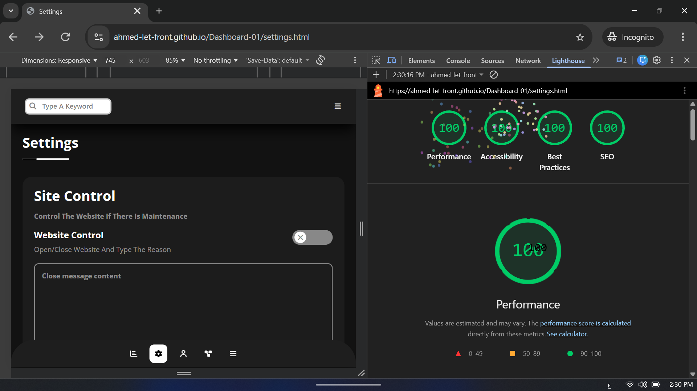

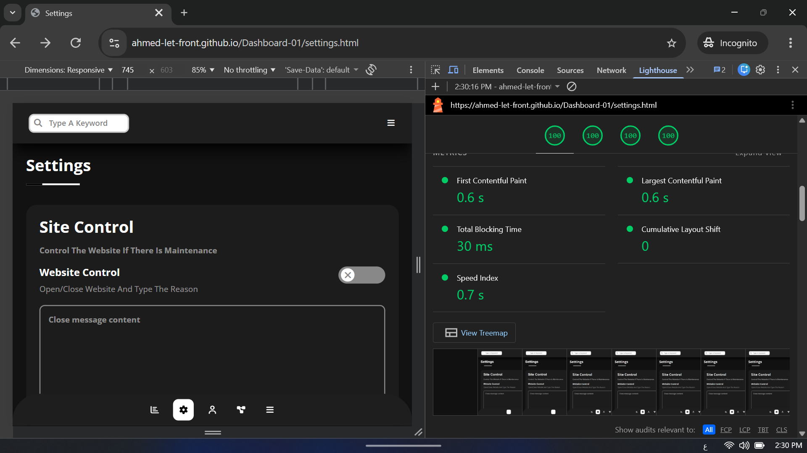

---

### 👤 Profile Page

- **Scores:** Performance: 100 \| Accessibility: 100 \| Best Practices: 100 \| SEO: 100
- **Core Web Vitals:** First Contentful Paint: 0.5s \| Largest Contentful Paint: 0.7s \| CLS: 0.001

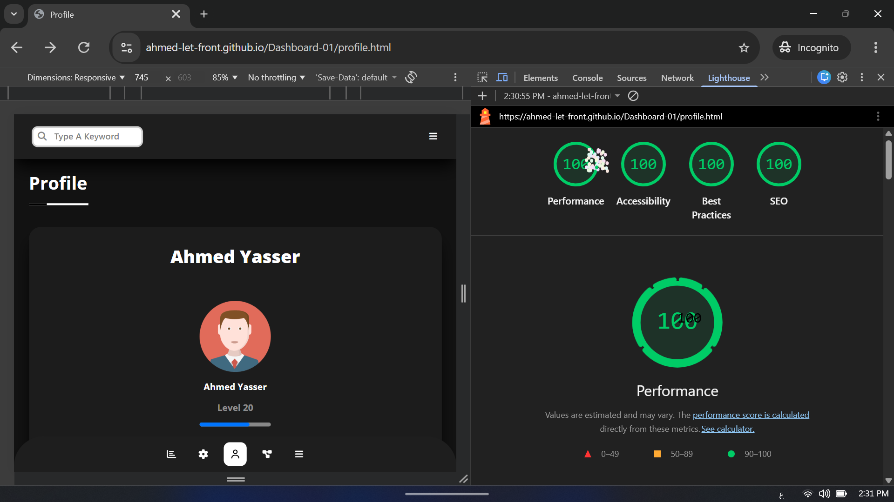

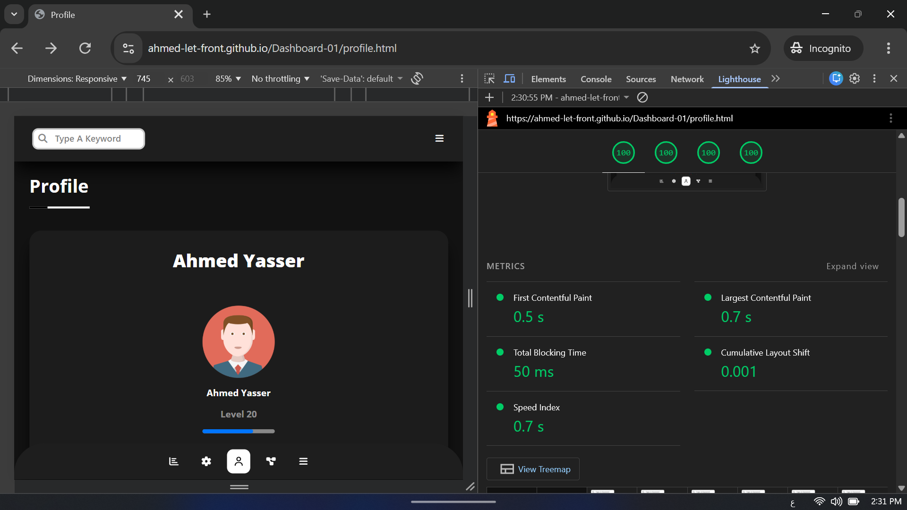

---

### 💼 Projects Page

- **Scores:** Performance: 100 \| Accessibility: 100 \| Best Practices: 100 \| SEO: 100
- **Core Web Vitals:** First Contentful Paint: 0.4s \| Largest Contentful Paint: 0.4s \| CLS: 0.001

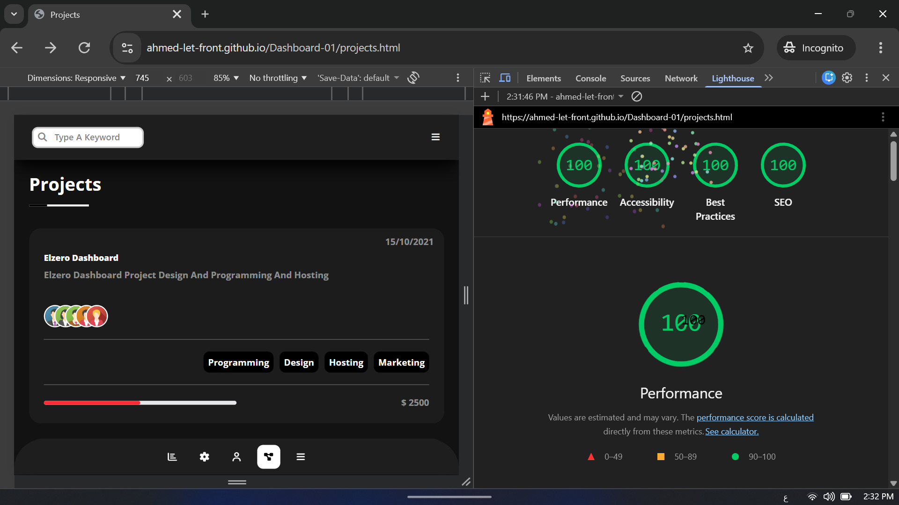

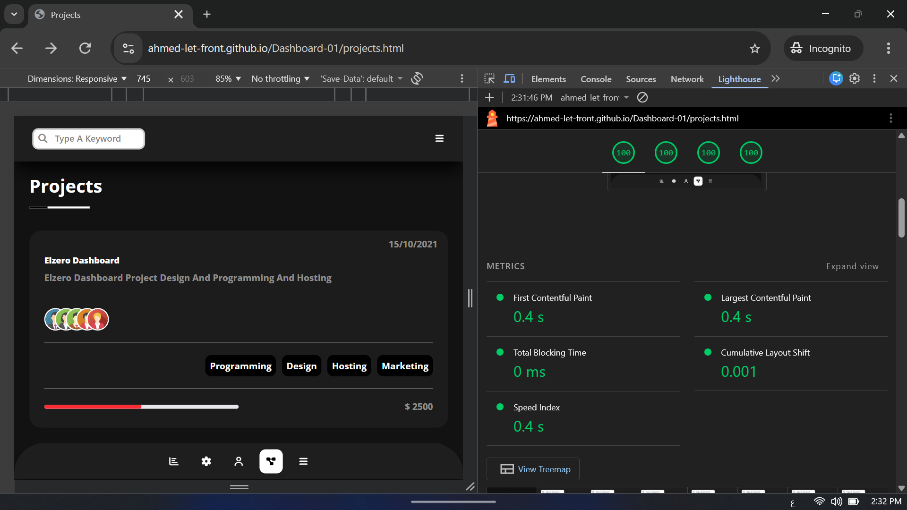

---

### 🎓 Courses Page

- **Scores:** Performance: 100 \| Accessibility: 100 \| Best Practices: 100 \| SEO: 100
- **Core Web Vitals:** First Contentful Paint: 0.5s \| Largest Contentful Paint: 0.5s \| CLS: 0.001

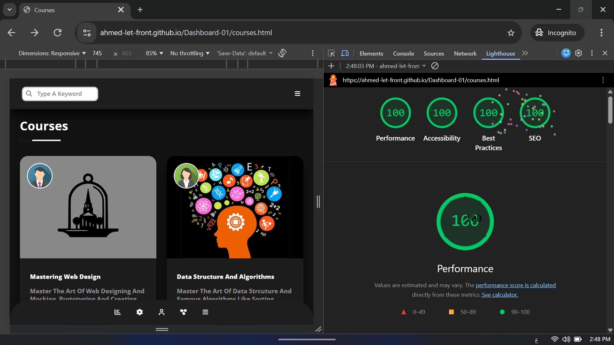

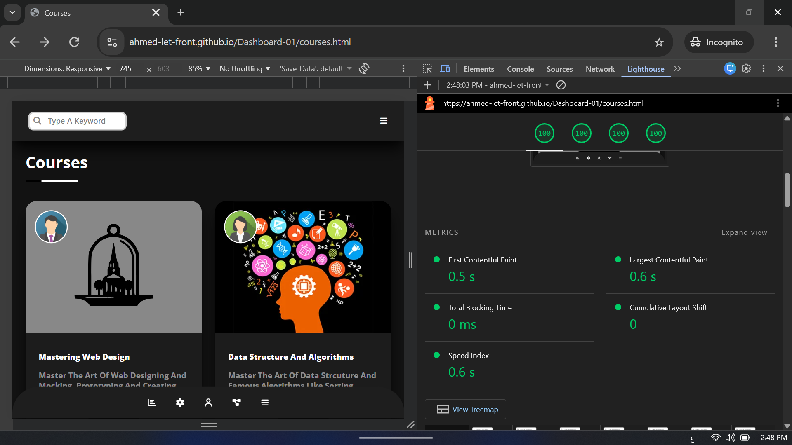

---

### 👥 Friends Page

- **Scores:** Performance: 100 \| Accessibility: 100 \| Best Practices: 100 \| SEO: 100
- **Core Web Vitals:** First Contentful Paint: 0.6s \| Largest Contentful Paint: 0.7s \| **CLS: 0**

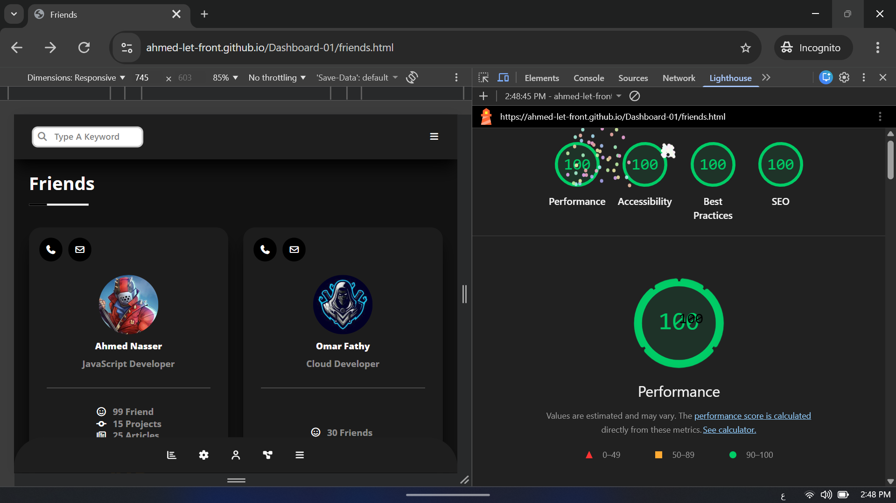

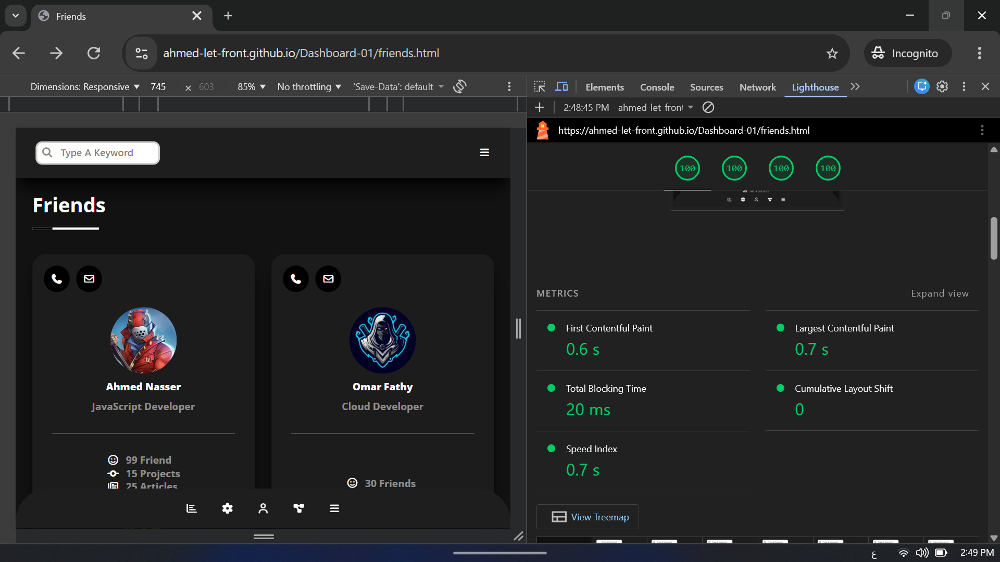

---

### 📁 Files Page

- **Scores:** Performance: 100 \| Accessibility: 100 \| Best Practices: 100 \| SEO: 100
- **Core Web Vitals:** First Contentful Paint: 0.4s \| Largest Contentful Paint: 0.4s \| CLS: 0.006

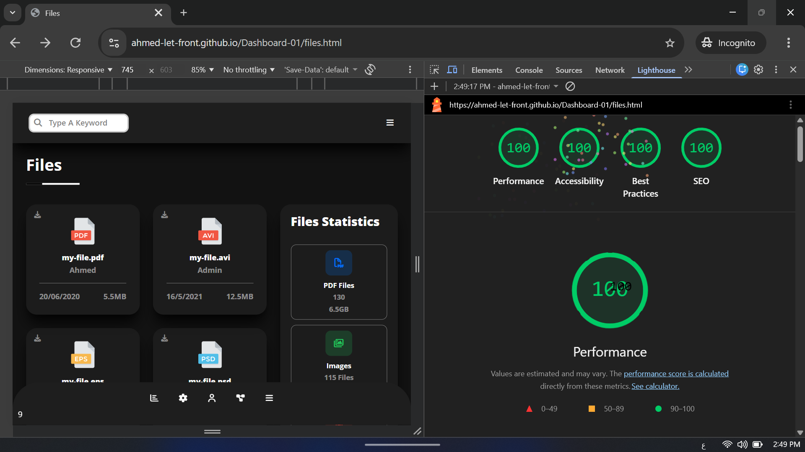

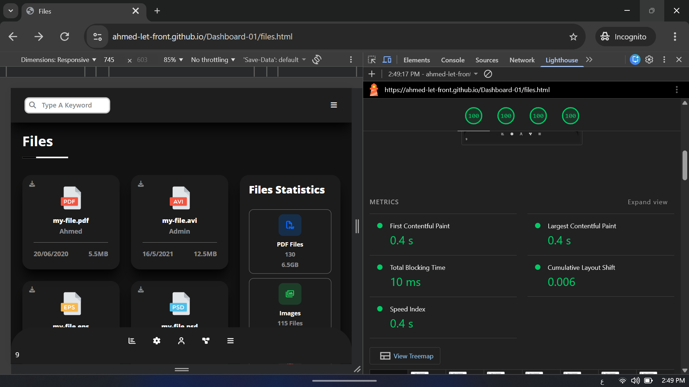

---

### 💳 Plans Page

- **Scores:** Performance: 100 \| Accessibility: 100 \| Best Practices: 100 \| SEO: 100
- **Core Web Vitals:** First Contentful Paint: 0.4s \| Largest Contentful Paint: 0.4s \| **CLS: 0**

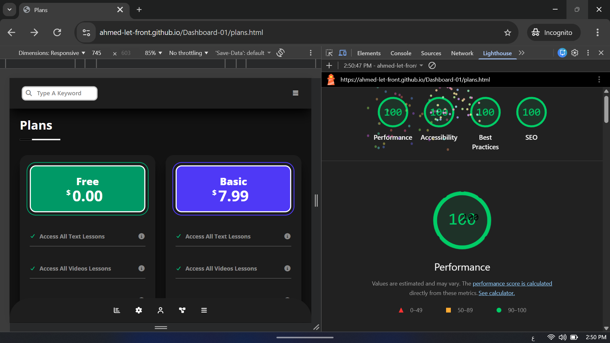

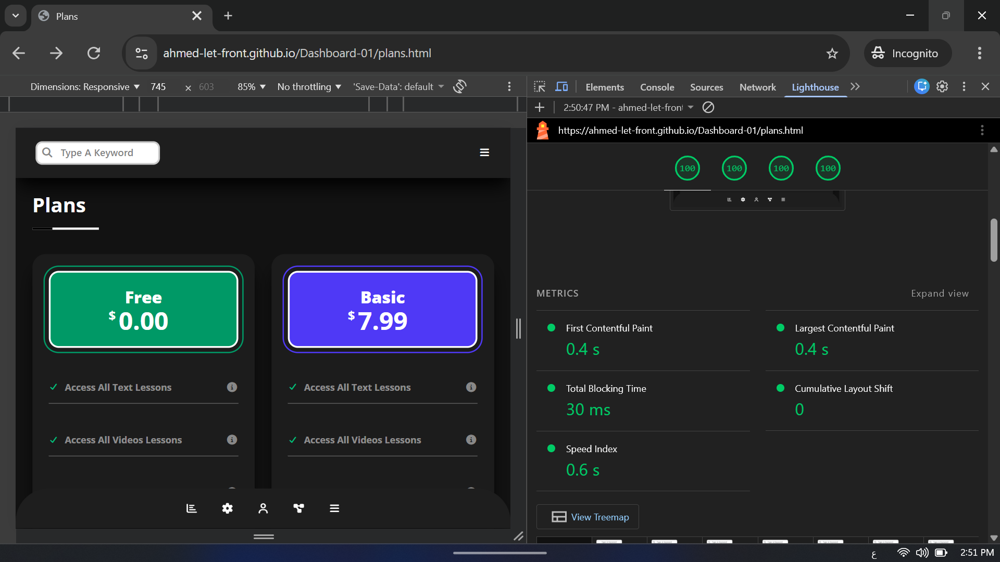

---

## 👨‍💻 THE CRAFTSMAN: AHMED YASSER

> "Engineering is not merely writing code that works; it is crafting an architecture that scales, performs, and speaks for itself."

I am a **15-year-old Junior Front-End Developer** with a relentless obsession for performance, clean architecture, and pixel-perfect rendering.

- **Daily Commitment:** I dedicate **8 to 10 hours daily** to deep-work, mastering CSS algorithms, and understanding the DOM at a microscopic level.
- **Project Portfolio:** Successfully engineered and delivered **14+ high-performance projects** in under a few months of active learning.
- **Vision:** To fully master the Browser Rendering Engine and build the next generation of scalable web applications.

---

### 📞 LET'S CONNECT

|                                                      LinkedIn                                                      |        GitHub        |                       Email                       |      WhatsApp      |
| :----------------------------------------------------------------------------------------------------------------: | :------------------: | :-----------------------------------------------: | :----------------: |
|  | [Ahmed-let-front](#) | [letcosdgp@gmail.com](mailto:letcosdgp@gmail.com) | `+20 105 011 9571` |

